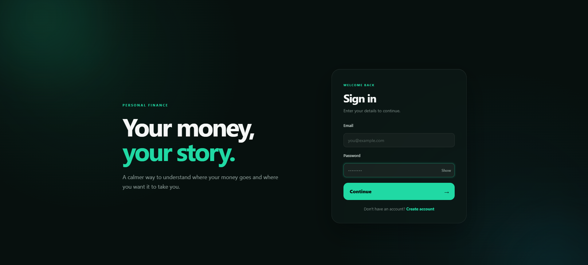
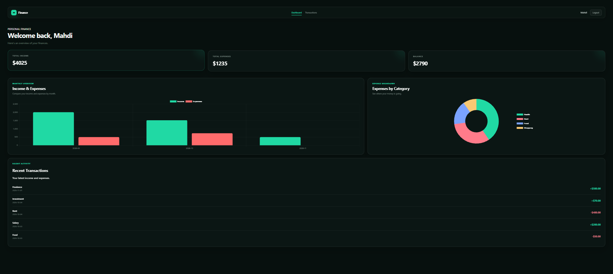
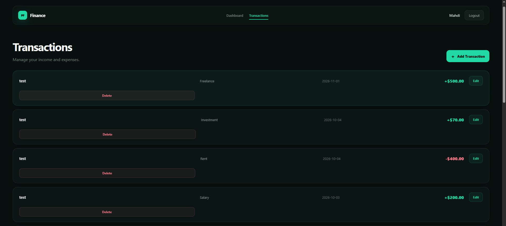
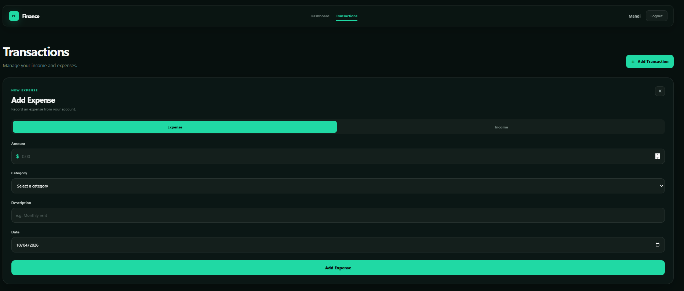

# Personal Finance Tracker

A full-stack web application that I built to manage personal income and expenses.

The application allows users to create an account, log in, add income and expenses, edit and delete transactions, and view their financial data through a dashboard with charts.

## Features

- User registration and login
- JWT authentication
- Add, edit, and delete transactions
- Add income and expenses separately
- Expense categories
- Income sources
- Dashboard with total income, expenses, and balance
- Monthly financial summary
- Expenses by category chart
- Recent transactions
- Protected pages for logged-in users
- Responsive design for different screen sizes

## Screenshots

### Login



### Dashboard



### Transactions



### Add Transaction



## Tech Stack

### Frontend

- React
- Vite
- JavaScript
- CSS
- Chart.js

### Backend

- Node.js
- Express.js
- JWT
- bcryptjs

### Database

- PostgreSQL

### Tools

- Git
- GitHub
- VS Code

## Project Structure

```text
personal-finance-tracker/
├── backend/
│   └── src/
│       ├── config/
│       ├── controllers/
│       ├── middleware/
│       ├── routes/
│       └── server.js
├── frontend/
│   └── src/
│       ├── components/
│       ├── pages/
│       ├── services/
│       ├── App.jsx
│       └── main.jsx
├── .gitignore
└── README.md
```

## How to Run the Project

### 1. Clone the repository

```bash
git clone https://github.com/mahdialjoharii/personal-finance-tracker.git
cd personal-finance-tracker
```

### 2. Setup the backend

```bash
cd backend
npm install
```

Create a `.env` file inside the `backend` folder:

```env
DB_HOST=localhost
DB_PORT=5432
DB_NAME=personal_finance_tracker
DB_USER=postgres
DB_PASSWORD=your_postgresql_password
JWT_SECRET=your_jwt_secret_key
```

Make sure PostgreSQL is installed and the database `personal_finance_tracker` exists.

Then start the backend:

```bash
npm run dev
```

The backend will run on:

```text
http://localhost:5000
```

### 3. Setup the frontend

Open a new terminal and go to the frontend folder:

```bash
cd frontend
npm install
```

Start the frontend:

```bash
npm run dev
```

The frontend will run on:

```text
http://localhost:5173
```

Make sure the backend is running at the same time.

### 4. Database Setup

The project uses PostgreSQL as the database.

Create a database with the following name:

```text
personal_finance_tracker
```

The backend uses the database settings from the `.env` file.

The main tables used by the application are:

- `users`
- `transactions`
- `categories`
- `income_sources`

Make sure PostgreSQL is running before starting the backend.

## Authentication

The application uses JWT for authentication.

After logging in, the user receives a token that is used to access protected API routes.

Passwords are hashed using bcrypt before being stored in the database.

## API

The backend provides REST API endpoints for:

- Authentication
- Transactions
- Categories
- Income sources
- Dashboard data

Protected endpoints require a valid JWT token.

## What I Learned

While working on this project, I learned more about:

- Building a full-stack application with React and Node.js
- Creating REST APIs with Express
- Working with PostgreSQL and SQL queries
- Connecting the frontend with the backend
- User authentication with JWT
- Password hashing with bcrypt
- CRUD operations
- Working with protected routes
- Displaying data using charts
- Using Git and GitHub during development
- Organizing a project into controllers, routes, middleware, and components

This project also helped me understand how the frontend, backend, database, and authentication work together in a real application.

## Future Improvements

Some features I may add to the project in the future:

- Monthly and yearly reports
- Export transactions to CSV or PDF
- More advanced filtering and search
- Better notifications and error messages
- Deploying the application online
- Improving the dashboard with more financial statistics